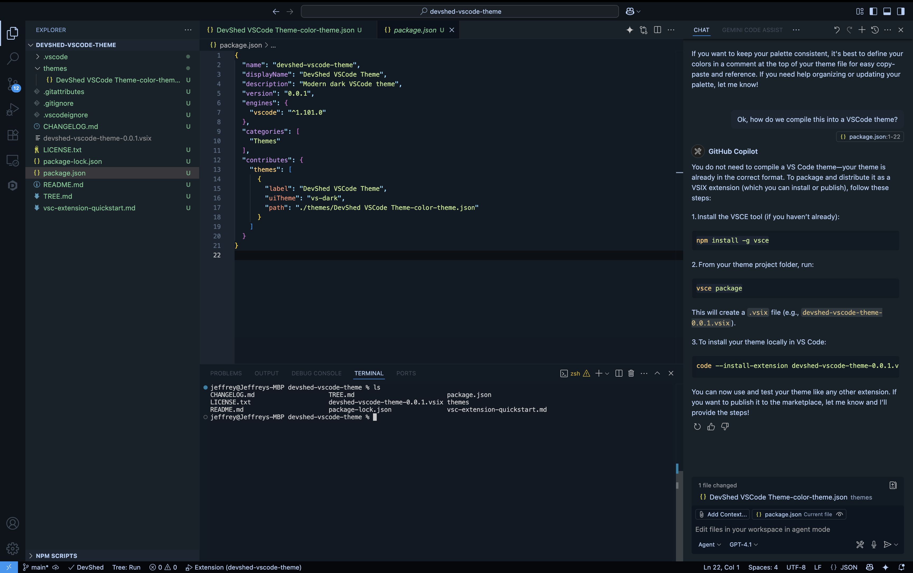

# DevShed VSCode Theme

Dark blue greys theme for VSCode flavored editors with interactive theme adjustment.

## Features

- **Base Theme**: Modern dark theme with blue-grey color palette
- **Interactive Adjustment**: Real-time theme customization via status bar
- **Three Adjustment Categories**:
  - **Brightness**: Dark, Normal, Bright editor backgrounds
  - **Shade**: Blueish, Charcoal, Classic color schemes
  - **Font**: Dim, Normal, Bright text visibility

## Usage

1. Install the extension
2. Select "DevShed VSCode Theme" from the theme picker
3. Click the "🎨 Theme" button in the status bar to adjust settings
4. Follow the step-by-step prompts to customize brightness, shade, and font

## Releases
- v0.0.2 - Added interactive theme adjustment interface
- v0.0.1 - Initial release

**Enjoy!**
